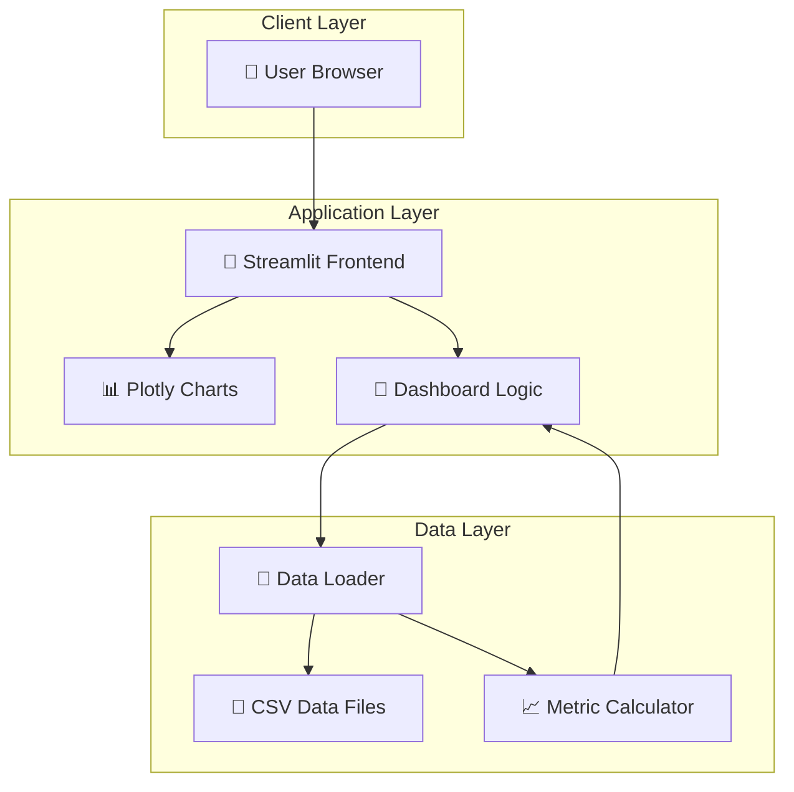
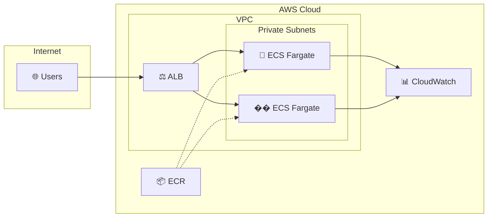
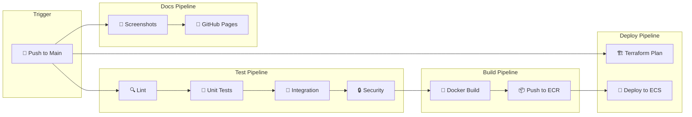
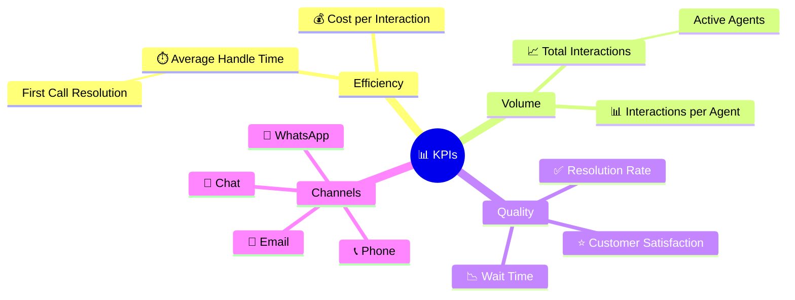

<div align="center">

# 📊 Call Center Analytics Dashboard

[](https://github.com/GRamos199/call-center-analytics/actions/workflows/test.yml)
[](https://github.com/GRamos199/call-center-analytics/actions/workflows/terraform.yml)
[](https://github.com/GRamos199/call-center-analytics/actions/workflows/deploy.yml)
[](https://github.com/GRamos199/call-center-analytics/actions/workflows/pages.yml)

**A modern, interactive Streamlit dashboard for call center performance analytics**

[Live Preview](https://gramos199.github.io/call-center-analytics/) • [Documentation](#documentation) • [Getting Started](#getting-started)


</div>

---

## 🎯 Overview

Call Center Analytics is a comprehensive dashboard that provides real-time insights into call center operations. Built with Streamlit and designed with a modern UI, it offers intuitive visualizations for monitoring KPIs, agent performance, and channel metrics.

### ✨ Key Features

| Feature | Description |
|---------|-------------|
| 📊 **Multi-Period Analysis** | Switch between monthly and weekly reports |
| 📈 **Interactive Charts** | Dynamic visualizations with Plotly |
| 👥 **Agent Performance** | Individual agent metrics and rankings |
| 📡 **Channel Analytics** | Phone, Email, Chat, WhatsApp breakdown |
| 🎨 **Modern UI** | Animated gradients and glassmorphism design |
| 🐳 **Docker Ready** | One-command deployment with Docker Compose |
| ☁️ **AWS Infrastructure** | Production-ready Terraform for ECS Fargate |
| 🔄 **CI/CD Pipeline** | Automated testing, building, and deployment |

---

## 🖼️ Screenshots

<div align="center">

| Welcome Page | Monthly Report |
|:------------:|:--------------:|
|  |  |

</div>

> 📸 **Live Preview**: Visit the [GitHub Pages](https://gramos199.github.io/call-center-analytics/) for full dashboard screenshots and PDF download.

---

##  Architecture



---

## 📁 Project Structure

```
call-center-analytics/
├── 📂 analytics/                 # Main application
│   ├── 📄 app.py                 # Streamlit entry point
│   ├── 📂 classes/               # UI components
│   │   ├── �� content_tabs/      # Tab content renderers
│   │   ├── 📄 base_tab.py        # Base tab class
│   │   ├── 📄 monthly_tab.py     # Monthly view
│   │   ├── 📄 weekly_tab.py      # Weekly view
│   │   └── 📄 style_manager.py   # CSS styling
│   ├── �� reporting/             # Report logic
│   │   ├── 📂 monthly/           # Monthly calculations
│   │   ├── 📂 weekly/            # Weekly calculations
│   │   └── 📄 welcome_page.py    # Welcome animation
│   ├── 📂 utils/                 # Utilities
│   │   ├── 📄 data_loader.py     # Data loading
│   │   ├── 📄 metric_loader.py   # KPI calculations
│   │   └── 📄 data_generator.py  # Synthetic data
│   └── 📂 data/                  # CSV data files
│       ├── 📂 monthly/           # Monthly datasets
│       └── 📂 weekly/            # Weekly datasets
├── 📂 terraform/                 # AWS Infrastructure
│   ├── 📄 main.tf                # Provider config
│   ├── 📄 vpc.tf                 # Network setup
│   ├── 📄 ecs.tf                 # Container service
│   ├── 📄 alb.tf                 # Load balancer
│   └── 📄 ...                    # Other resources
├── 📂 .github/workflows/         # CI/CD Pipelines
│   ├── 📄 test.yml               # Testing workflow
│   ├── 📄 terraform.yml          # Infrastructure
│   ├── 📄 deploy.yml             # Deployment
│   └── 📄 pages.yml              # Documentation
├── 📂 tests/                     # Test suite
├── 📄 Dockerfile                 # Container image
├── 📄 docker-compose.yml         # Local deployment
└── 📄 requirements.txt           # Python dependencies
```

---

## �� Getting Started

### Prerequisites

- Python 3.12+
- Docker & Docker Compose (optional)
- AWS CLI (for cloud deployment)

### Local Development

```bash
# Clone the repository
git clone https://github.com/GRamos199/call-center-analytics.git
cd call-center-analytics

# Create virtual environment
python -m venv venv
source venv/bin/activate  # Linux/Mac
# or: venv\Scripts\activate  # Windows

# Install dependencies
pip install -r requirements.txt

# Run the application
cd analytics
streamlit run app.py
```

The dashboard will be available at `http://localhost:8501`

### Docker Deployment

```bash
# Build and run with Docker Compose
docker-compose up -d

# View logs
docker-compose logs -f

# Stop the container
docker-compose down
```

---

## ☁️ AWS Deployment

The project includes complete Terraform infrastructure for deploying to AWS ECS Fargate.



### Deploy with Terraform

```bash
cd terraform

# Initialize Terraform
terraform init

# Review the plan
terraform plan

# Apply infrastructure
terraform apply
```

### AWS Resources Created

| Resource | Description |
|----------|-------------|
| VPC | Isolated network with public/private subnets |
| ECS Cluster | Fargate serverless container platform |
| ECR | Docker image registry |
| ALB | Application Load Balancer with health checks |
| Auto Scaling | CPU/Memory-based scaling policies |
| CloudWatch | Logging and monitoring with alarms |
| IAM Roles | Secure execution and task roles |

---

## 🔄 CI/CD Pipeline



### Workflow Files

| Workflow | Trigger | Description |
|----------|---------|-------------|
| `test.yml` | Push/PR | Linting, testing, security scan |
| `terraform.yml` | Terraform changes | Infrastructure validation and deployment |
| `deploy.yml` | Push to main | Docker build and ECS deployment |
| `pages.yml` | Push to main | Generate screenshots and publish docs |

---

## 📊 Metrics & KPIs

The dashboard tracks the following key performance indicators:



---

## 🛠️ Tech Stack

| Category | Technology |
|----------|------------|
| **Frontend** | Streamlit, Plotly, Custom CSS |
| **Backend** | Python 3.12, Pandas, NumPy |
| **Containerization** | Docker, Docker Compose |
| **Infrastructure** | Terraform, AWS ECS Fargate |
| **CI/CD** | GitHub Actions |
| **Testing** | Pytest, Black, isort, Flake8 |

---

## 🧪 Testing

```bash
# Run all tests
pytest tests/ -v

# Run with coverage
pytest tests/ --cov=analytics --cov-report=html

# Code formatting
black analytics/
isort analytics/ --profile black

# Linting
flake8 analytics/
```

---

## 📝 Environment Variables

| Variable | Description | Default |
|----------|-------------|---------|
| `STREAMLIT_SERVER_PORT` | Application port | `8501` |
| `STREAMLIT_SERVER_ADDRESS` | Bind address | `0.0.0.0` |

---

## 🤝 Contributing

1. Fork the repository
2. Create a feature branch (`git checkout -b feature/amazing-feature`)
3. Commit changes (`git commit -m 'Add amazing feature'`)
4. Push to branch (`git push origin feature/amazing-feature`)
5. Open a Pull Request

---

## 📄 License

This project is licensed under the MIT License - see the [LICENSE](LICENSE) file for details.

---

<div align="center">

**Built with ❤️ using Streamlit**

[⬆️ Back to Top](#-call-center-analytics-dashboard)

</div>
